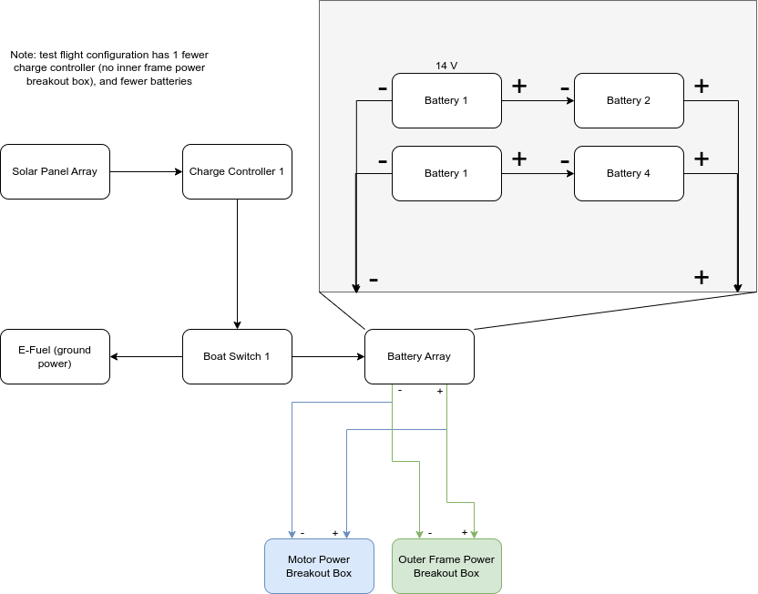
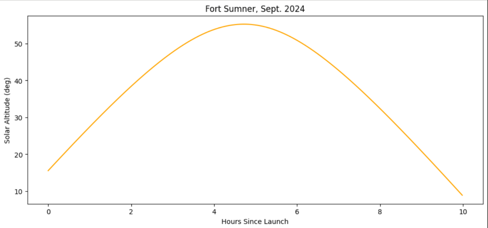
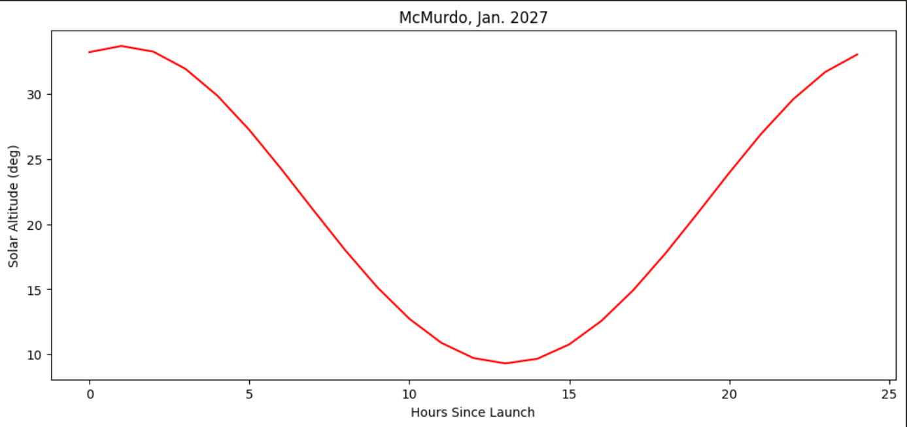
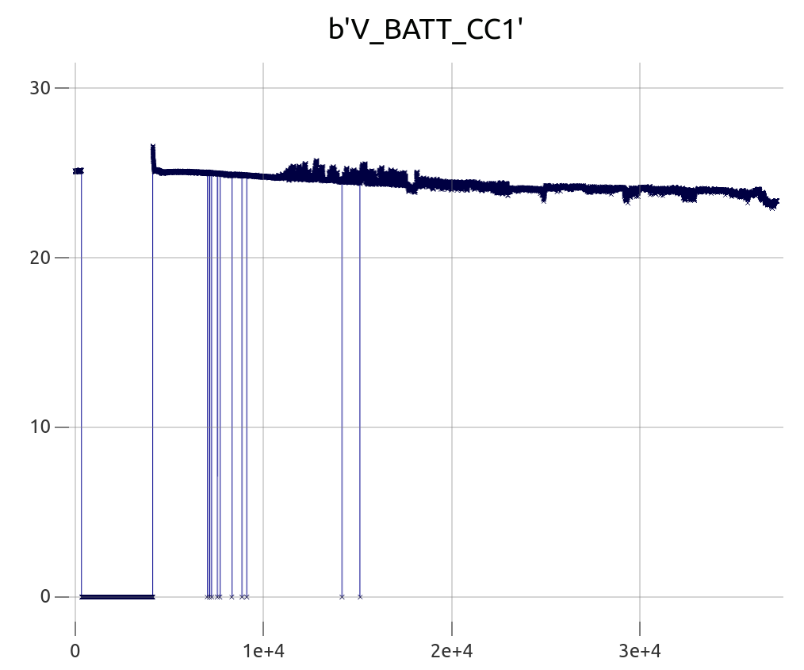
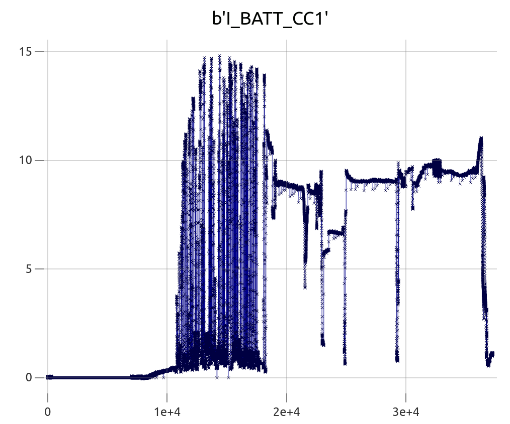
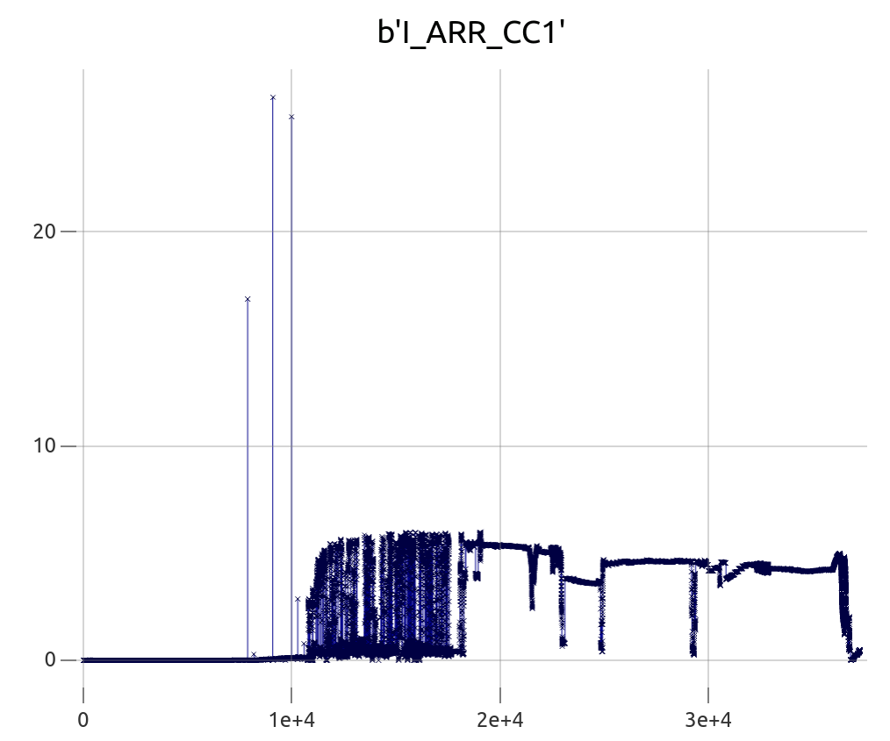
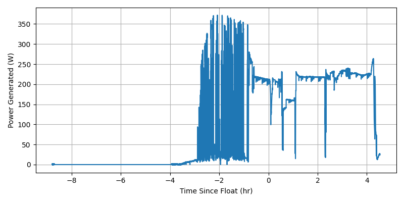
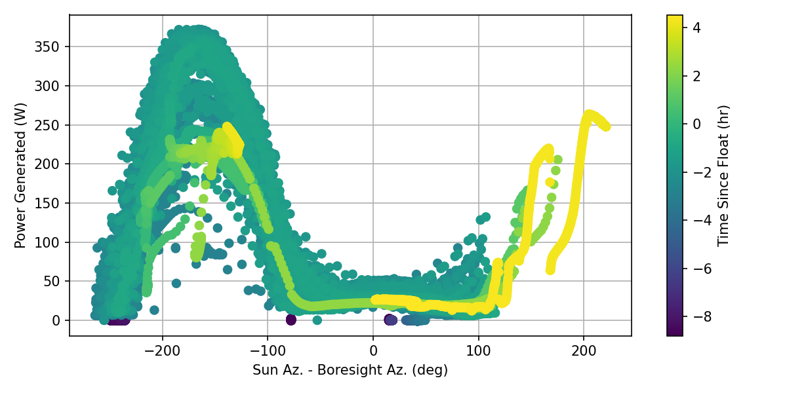
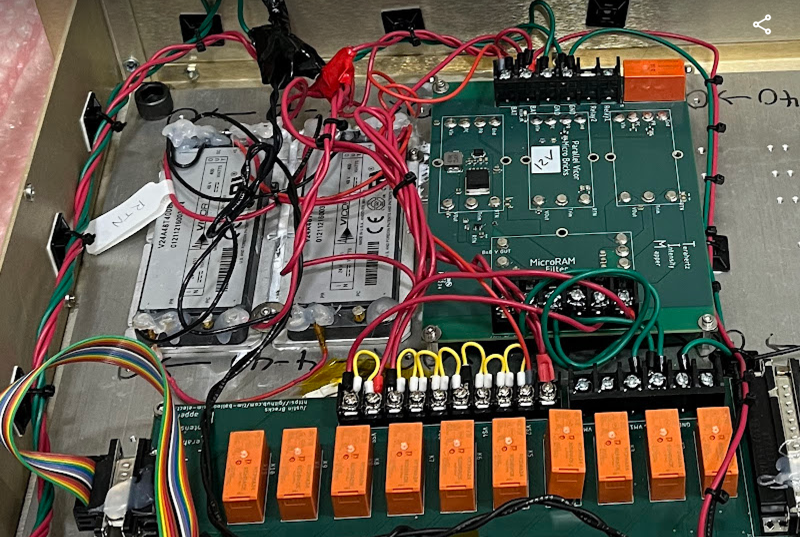

Evan C. Mayer

2024-12-09

TIM Test Flight Analysis: Power Generation and Consumption

# Overview

During the TIM test flight and on the ground, during daylight hours, the solar panels successfully powered the gondola via the charge controller and battery bank. Power generation was grossly proportional to the sun-relative azimuth, and to a lesser extent proportional to solar elevation. We give an estimate of the power production of a single solar array and an accounting of the power consumption to the granularity possible, given the voltage and current monitoring present on the test flight.

# Background

The general power scheme for TIM, and many scientific balloon experiments, is similar to a residential solar power installation. An array of solar panels charges a bank of batteries via a "charge controller," a self-contained computer that implements [maximum power point tracking (MPPT)](https://en.wikipedia.org/wiki/Maximum_power_point_tracking) to most efficiently use the voltage and current generated by the array for a given solar flux.

## System Description

For the test flight, the power subsystem was configured as shown below.

### Solar Panels

The TIM solar panels are a custom implementation based on BLAST-TNG panels. The test flight articles are actual BLAST-TNG spares. They closely mimic the CSBF-supplied solar panels: an aluminum hexagon honeycomb inside a lightweight balsawood frame, sandwiched by a solar cell module and FR4 sheet. Each module is sandwiched in a thick, protective, flexible plastic. [We flew 3](https://photos.app.goo.gl/rt4JH1E3eeVkBUvk7). A voltage difference across the solar panel array terminals is used to charge the batteries.

### Charge Controller

The [Tristar TS-MPPT-60](https://www.morningstarcorp.com/products/tristar-mppt/) charge controller (CC) is powered on when voltage is present across the CC's battery terminals. It has a 60 A capacity, and is configured to charge banks of serialized and parallelized powersport batteries at 28 V. When voltage is present at the solar panel array terminals, the charge controller presents a variable load to the panel to optimize the power transfer (MPPT). The CC is designed to do this with loss <1%.

The CC communicates status information to the in-charge flight computer via the [ModBus protocol](https://drive.google.com/file/d/1dru76f3ICAz15AmSEqMkE19wloMXTp-G/view?usp=drive_link) over TCP/IP (Ethernet).

### Batteries

TIM flies banks of Odyssey [ODS-AGM42L](https://www.batterymart.com/p-odyssey-pc1200-battery.html?srsltid=AfmBOoqhsSQc0bYXbPRaWaNtPGrAPS_95PNpe5s3wGVoO3FU4nBCS7o8) Extreme Powersport (PC1200) batteries, serialized to 28 V. The actual voltage is slightly higher than 28 V when fully charged and under no load. These batteries are a dry cell sealed design, making them user-friendly for gondolas and giving them a good range of temperature tolerance (-40 - 45 C).

### Boat Switch

The boat switch (a marine switch used to swap boat power between shore and batteries) determines whether the batteries are connected to ground power (a high-current AC-DC converter known as a [SkyRC eFUEL](https://www.nitroplanes.com/26p-efuel-60a.html?srsltid=AfmBOoqrKxHNxqv5lNJIscahAd5qj-hf11nKkdpvRlX0-X6SGJWTyNbA)) or the charge controller. When ground power is selected, the batteries are charged or kept topped up according to the voltage across the eFUEL terminals. When the charge controller is selected, battery voltage is applied to the charge controller, turning it on.

### Power Breakout Boxes (PBoBs)

Justin Bracks [designed enclosures](https://github.com/tim-balloon/tim-electronics/tree/main/PBoB) with power conditioning, monitoring, and distribution circuits to convert the raw battery voltage to useful voltages for the gondola subsystems: 48, 24, 12, and 5 VDC. Battery power goes in, Vicor DC-DC converters adjust the voltage, Vicor uRAM filters clean up the output, and a system of LabJack-controlled relays switch power on and off to front panel connectors. Voltage and current monitors are sampled by the LabJack ADCs and reported to the flight computers via ModBus over TCP/IP. 

## Differences Between Test and Science Flights

The test flight has one copy of the solar power system, while the science flight will have two charge controllers and boat switches. We assume the science flight will fly 12 solar panel modules.

The solar cells for the science flight are based on the same individual cells to maintain BLAST heritage. The SBM6X5SL modules are provided by SBM Solar, Inc., and tested at 100 mW/cm^2 irradiance, with a post-manufacture maximum power test result of 134 W at room temperature. The original power system design called for 1200 W of generation capacity, implying a full array of at 9-12 modules, depending on the efficiency they achieve at float. Test flight thermistor data suggests the space inside the panel modules was very cold, -30 C, so we do not expect to need to de-rate the room temperature test results (solar panel efficiency decreases with increasing temperature). The solar irradiance at float may be closer to 1300 W/m^2, so we may expect up to 1.3x the power, for a theoretical maximum of 174 W per panel.

The test flight experienced solar elevation angles from ~7.6 - 55.0 degrees.

At McMurdo, the solar elevation angle will range from ~9.3 - 33.7 degrees.

We expect performance during the science flight similar to the test flight performance when the solar elevation angles are comparable; the Antarctic solar elevation range is also more favorable for more of the time, giving closer to normal solar incidence at a similar solar-relative azimuth angle. The solar panel orientation is designed to optimize this angle of incidence.

Preflight checkouts of the test flight solar panel array revealed a flaky connection to 1 of 3 panels of the array, and so it is possible we experienced decreased power as a result. The array tested abnormally before integration on the gondola (low open circuit voltage) and normally afterward.

Given these arguments, we will assume the same power generation *per module flown* as a lower bound for the science flight. If during the test flight, we actually generated power using 2 of 3 panels (worst-case scenario, given the flakiness seen on the ground), we will take this into account as "yield," and divide the total power production by the total number of modules flown.

## Telemetry Variables

The CC reports many flags for error conditions and samples the input and output voltages and currents. We are interested in these variables (quoted content from [manufacturer docs](https://www.morningstarcorp.com/wp-content/uploads/technical-doc-tristar-mppt-modbus-specification-en.pdf)):

* `V_BATT_CC1`: "Voltage measured directly at the battery power connections on the TriStar MPPT."
* `I_BATT_CC1`: "Charging current to the battery as measured by on-board shunts."
* `V_ARR_CC1`: "The terminal voltage of the solar input connection."
* `I_ARR_CC1`: "Input current from the solar array. NOTE: Input current is not measured by precision shunts and may differ from the actual input current by +/- 20%."

Overview plots, variable vs. telemetry frame index:

If you need a rough ballpark for our power generation, take data from just before the 2e4 mark; here we have reached float, and the solar elevation angle is ~40 deg.

$$ P_{batt} = I_{batt} \cdot V_{batt} \simeq 8.9 \, \textrm{A} * 24.5 \, \textrm{V} $$

$$ P_{batt} \simeq 220 \, \textrm{W} $$

As the day progressed, we remained in this ballpark power production. For the majority of the flight, we performed maneuvers about the "anti-sun" orientation, which was intended to maximize our power output. During the test flight, we hit a max power generation of 372 W on ascent. This max power is 1.7x the average at-float value, a difference that cannot be accounted for by geometrical factors such as attaining a more favorable angle of incidence during ascent by swaying under the flight train; an additional tilt of ~53 degrees would be required to explain the difference this way. Rather, it seems more likely that only 2/3 of the modules were functioning at float, as assumed above.

For the science flight, we assume an average achieved power production of 73 W per module flown, and 12 modules, for a total power output of 880 W. For an optimistic number, we may take the peak power production per module (174 W) above.

* **Estimate: 876 W**
* **Theoretical Maximum: 2088 W**

# Power Generation vs. Sun-Relative Azimuth

The maximum power generation was centered in a broad peak around -165 degrees, i.e., the Sun was aft and slightly port of boresight.

This agrees with the orientation of the solar array. There is a mild, low-magnitude peak 180 degrees opposed, which we attribute to sunlight shining through the diffuse FR4 composite sheet and aluminum honeycomb from the backside of the array. After float, the power generation agrees more closely with the estimate above, in the 200-250 W range.

# Power Consumption vs. Subsystem

For these estimates, we take the operating voltage as measured by preflight checkouts with a DMM and the current sensor reading during flight from the PBoB.

> **ASIDE:** Voltage monitoring
>
> Some of the voltage monitor readings are obviously wrong. Outer frame PBoB voltages monitors reported roughly 21 V, 3.9 V, and 4.5 V, none of which were the actual voltages measured by DMMs. One should have read ~5 V for the GPS and thermistors. The others should have read 12 V for all other devices which could not have taken raw battery power. Voltage monitors outputs from the Vicor boards should have been connected to the terminals on the relay board in order to be read by the LabJack. We have evidence that on Aug. 18, only VM1, 12 V monitor, was in use on the motor PBoB, so we can probably trust that one.
>
> 
>
> Motor PBoB voltage monitors reported ~12 V, ~27 V, and ~24 V, however all except two devices (inclinometers and watchdog) were connected to raw battery voltage passthrough, with no Vicor, so the voltage sense cannot be valid for those two channels.

| Subsystem | Nominal Voltage (V) | Avg. Current Draw (A) | Avg. Power Draw (W) | Peak Current Draw (A) | Peak Power Draw (W) |
| --------- | ------------------- | --------------------- | ------------------- | --------------------- | ------------------- |
| FC1 | 12 | 0.945 | 11.3 | 1.46 | 17.5|
| FC2 | 12 | 0.956 | 11.5 | 1.55 | 18.6 |
| Gyros + magnetometers | 12 | 0.904 | 10.8 | 1.38 | 16.6 |
| SC1 | 12 | 0.95 | 11.4 | 1.58 | 19.0 |
| SC2 | 12 | 0.95 | 10.9 | 1.41 | 17.0 |
| GPS | 5 | 0.78 | 3.9 | 1.31 | 6.54 |
| Warm Thermometry | 5 | 0.64 | 3.2 | 1.19 | 5.96 |
| Reaction Wheel Motor | 48 | 0.62 | 29.6 | 2.83 | 136 |
| Elevation Motor | 28 | 0.58 | 16.3 | 1.10 | 30.9 |
| Pivot Motor | 28 | 0.78 | 21.7 | 3.43 | 96.0 |
| Outer Frame Ethernet Switch + EtherCAT Switch + CC switch + RFSoC | 28 | 0.95 | 26.6 | 1.49 | 41.7 |
| Inner Frame Ethernet Switch | 28 | 0.59 | 16.6 | 1.22 | 34.2 |
| HDD Power Box | 28 | 0.86 | 24.1 | 1.84 | 51.6 |
| Actuator Bus (Lock Pin) | 28 | 0.55 | 15.5 | 1.10 | 30.9 |
| Pinhole Sun Sensor Array | 28 | 0.57 | 16.1 | 1.12 | 31.4 |
| Inclinometers | 12 | 0.55 | 6.57 | 1.08 | 13.0 |
| Watchdog | 12 | -0.10 | 2.49 | 1.03 | 12.3 |

Total: 238.5 W

Clearly, some of these readings are not to be trusted. Aside from the magical electron-creating watchdog, and the fact that many readings are strangely close to either 1 A or 0.5 A, we should not trust a 0.78 A average, 3.43 A peak, ~21 W average figure for the pivot, which for long periods (longer than the 1s report rate of this channel) was required to pull 8-15 A to avoid sticking.

For comparison, the motor controllers report current at 200 Hz, which gives us for the pivot 5.24 A average, 15.1 A peak, for a ~147 W average. For the reaction wheel, 1.67 A average, 14.9 A peak, and ~80 W average. For the elevation drive, 0.464 A average, 5.48 A peak, and ~13.0 W average. These three sources total up to ~240 W, equivalent to the entire gondola power draw reported by the PBoBs.

# Science Flight Power Budget

Rather than use the unreliable test flight power draw for non-motor items, we use rough estimates from datasheets.

| Item/Subsystem | Typical Power Draw (W) | Max Power Draw (W) | Qty. | Notes |
| -------------- | ---------------------- | ------------------ | ---- | ----- |
| ARK-1551-S6A1 | 13.87 | 47.12 | 4 | [Source](https://www.advantech.com/en-us/products/1-2jkbyz/ark-1551/mod_47d30ee7-28b6-41bc-83a1-a7ca416e68cd) |
| Star camera | 1.6 | 2.8 | 2 | Datasheet |
| Lens controller | 1 | 8 | 2 | Datasheet |
| Gyros + mags | 5 + 0.45 | 8 + 0.45 | 2 | Datasheet |
| GPS | 3 | 8 | 1 | Manual |
| LabJack (Warm thermometry, ...) | 1 | 3 | 6 |LabJack T7; no loads vs. max supply current; Assume N=6 on gondola |
| Reaction wheel motor | 80 | 715 | 1| See above |
| Elevation motor | 13 | 153 | 1 | See above|
| Pivot Motor | 147 | 423 | 1 | See above |
| Eth switch | 5 | 10 | 12 | Different types, unmanaged vs. managed; assume Planet IGS-10020MT as upper bound, and typ. power half of full load 10 W. Actual estimate is N=6, but we don't know 100% of devices that might need Eth.|
| RFSoC | 30 | 60 | 4 | HIGHLY dependent on workload. Max value based on mfgr.-supplied power adapter output. |
| HDDs | 5 | 20 | 2 | Based on per-HDD estimates of 5 W, 20 W and N=16, but assuming only 2 powered at once |
| Actuator Bus | 12 | 48 | 6 | Stepper motor; Based on 12 V, 1 A typ, 4 A peak draw|
| PSS Array | - | - | 8 | Hamamatsu S5991-01 & supporting circuitry negligible |
| Inclinometer | 1 | 2 | 2 | Based on 12 V, 0.06 A typ., 36 V, 0.06 A max |
| Watchdog | 1 | 1 | 1 | Guess; basically in the noise |
| Charge controller | 1.35 | 2.7 | 2 | Self-consumption |
| Cold thermometry | 3.75 | 10 | 1 | [Simon Tartakovsky](https://timballoon.slack.com/archives/CM2J8SWCT/p1733844639912629?thread_ts=1733842232.064579&cid=CM2J8SWCT) | 
| Fridge | 1 | 3 | | Ian guess "a few". Fridge cycle probably takes intermittent <1 W. |
| Action cameras | 2.8 | 5 | 3 | [Video recording, WiFi off](https://cam-do.com/pages/power-consumption-by-gopro-camera-model) |
| **Subtotal** | 601 | - | - | - |

[Juzz estimate](https://docs.google.com/spreadsheets/d/1SNJsAm4YPWWEj2rmwZxm6NFpBLD_LesIVccm7aLQ74Q/edit?gid=0#gid=0) ca. 2020 comes out to ~620 W. I account for the differences as a mix of Juzz assuming less motor power, fewer RFSoC at higher power, higher power draw on steppers, and adding in telemetry systems (video transmitters, biphase), which are actually powered by CSBF solar.

## Rough Battery Charging Estimates

We have 4 batteries, two parallel sets of two in series, for a nominal voltage of ~28 V (14 + 14). When batteries are connected in series, the capacity stays the same, but the voltage increases. When batteries are connected in parallel, their capacities add, so the battery array behaves like a 28 V, 84 A hr battery.

The manufacturer considers discharging to 80% a "deep cycle", [claiming](https://www.batterymart.com/p-odyssey-pc1200-battery.html?utm_source=google&utm_medium=cpc&utm_campaign=18144606429&gad_source=1&gclid=Cj0KCQiAx9q6BhCDARIsACwUxu7U8NUr7zrgQoIfiUHgb1XryHLgmUqRBOqRwQNKnctmEoWuCiB9eOQaAuvgEALw_wcB) "400 cycles at 80% depth of discharge". We take this as the "drained" state. They also claim "The highest recharge efficiency of any sealed lead battery on the market - capable of 100% recharge in 4 - 6 hours," so our estimate should jive with this.

The time required to restore the missing capacity, assuming perfect charging efficiency, is

$$ \frac{84~\textrm{A hr} \cdot 0.2}{\eta_{charge} I_{charge}}$$

for charging current $I_{charge}$ and charging efficiency $\eta_{charge}$. The CC has a maximum output of 60 A, but this is determined by the voltage differential of the battery terminals vs. the CC output. Typical recommendations for charging currents are 10-30% of the A hr capacity (8.4 A), and [typical charging efficiencies](https://www.bogartengineering.com/support/application_notes/rpc_battery_charging_efficiency.html) are 85-90%.

The available charging current will be the lesser of either the CC max output (60 A) or the wattage from the solar array, less the power consumed by the gondola, divided by the battery array voltage:

$$ \frac{876~\textrm{W} - 601~\textrm{W}}{28~\textrm{V}} \simeq 9.8~\textrm{A},$$

from which we can see that additional solar array headroom or less gondola power consumption gets us additional recharge ability.

$$ \frac{84~\textrm{A hr} \cdot 0.2}{0.85 \cdot 9.8~\textrm{A}} = 2~\textrm{hr}$$

> **NOTE:** It's not immediately clear to me what the MPPT logic of the CC will do in the situation where the gondola current draw and our desire to recharge the batteries exceeds the ideal current for MPPT tracking; presumably the CC battery voltage target of 28.5 V takes precedence when we are below this voltage and have available power.

## Conclusion

As a pessimistic estimate, we have ~275 W of excess power. From a power perspective, this would enable us to fly an extra computer (4 cores/8 threads, 1.6 GHz turbo to 4.1 GHz, up to 32 GB RAM) to perform onboard mapmaking at a penalty of ~5-17% of our excess capacity. Heat dissipation is another factor to consider.

The tradeoff in adding more devices is that having sufficient power headroom allows the CC to charge drained batteries faster. For a given wattage from the panels, the CC must sink the current draw of all gondola subsystems and some additional current to restore battery charge.

For these reasons, we recommend limiting the addition of a "science coprocessor" PC for inflight mapmaking to nothing more powerful than the ARK-1551. We also recommend exploring the possibility of flying auxiliary solar arrays in different orientations to augment the solar power generation and provide more angular coverage.